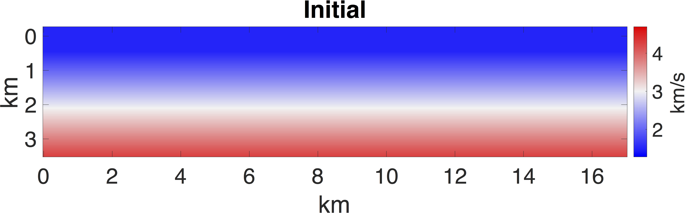
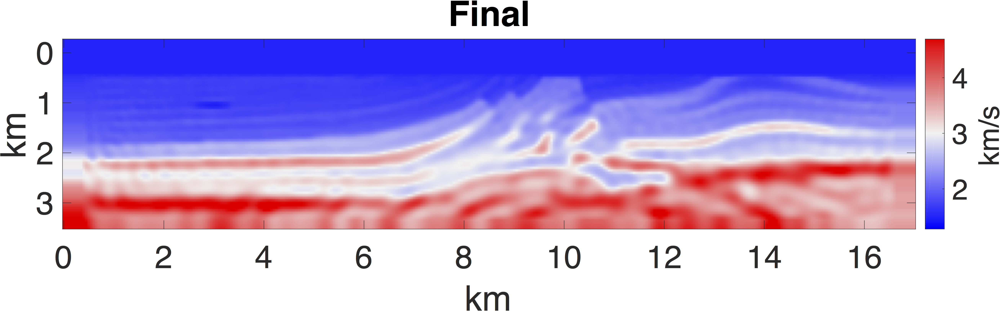
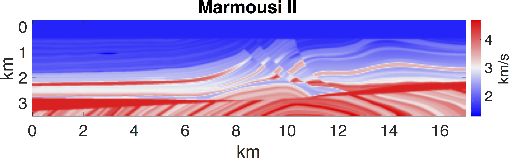

# Simple frequency domain full-waveform inversion (FWI) regularized by Sobolev space norm

(c) Vladimir Kazei and Oleg Ovcharenko (KAUST, 2019)

Helmholtz solver is a submodule, so clone with:
git clone --recursive https://github.com/vkazei/fastFWI.git

## Full-waveform inversion
Standard L2 full-waveform inversion  
||D(m)-D_obs||^2 + F_reg(m_0, m) is minimized  
where
D_obs is the observed data
D(m) is the data modeled in the model m  
m is current model  
m_0 is the starting model
F_reg is the regularizing functional

generic FWI implementation (misfit functional and gradient) is based on [SimpleFWI](https://github.com/TristanvanLeeuwen/SimpleFWI) by Tristan van Leeuwen
[LBFGS-B-C optimization implementation](https://github.com/stephenbeckr/L-BFGS-B-C) by [Stephen Becker](http://amath.colorado.edu/faculty/becker/)

## Sobolev space norm regularization
We add regularizing functional equivalent to Sobolev space norm for 
F_reg = ||m||W1p.  
[Kazei et al., 2017](http://www.earthdoc.org/publication/publicationdetails/?publication=88317)
It can also be applied as a regularizing 

## Example
We demonstrate an application of FWI to [Marmousi II benchmark velocity model](https://library.seg.org/doi/full/10.1190/1.2172306). We initiate inversion from a linear velocity model and search for updates of model parameters by L-BFGS.

[vladimir.kazei@kaust.edu.sa](vkazei.com)

